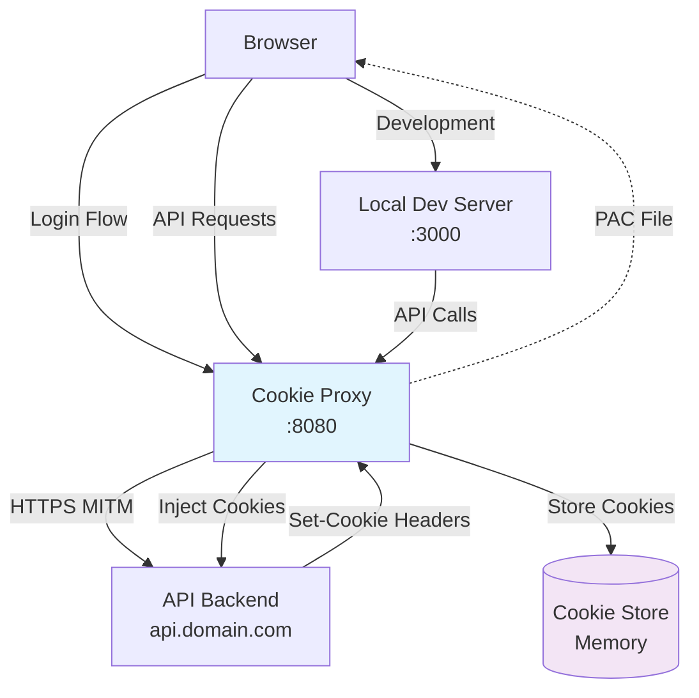

# HTTPS Cookie Proxy

> **Development unblocker for browser authentication cookie management**

## Problem

Local frontend development against authenticated APIs requires session cookies. Manual cookie management involves:
- Extracting cookies from browser dev tools
- Copying session tokens to development tools
- Re-authenticating when sessions expire
- Managing multiple authentication domains

## Solution

This tool addresses the immediate pain point by intercepting Set-Cookie headers from HTTPS login flows and injecting stored cookies into subsequent HTTPS API requests. **This is a development unblocker, not a definitive solution** - it enables local development workflow until proper authentication integration is available.

**Local development only** - not intended for production, CI/CD, or multi-instance deployment.



## Setup

### 1. Install mkcert (if not already installed)
```bash
# macOS
brew install mkcert
mkcert -install

# Windows  
choco install mkcert
mkcert -install
```

### 2. Build and Start Proxy
```bash
go build -o cookie-proxy .
./cookie-proxy --domains your-https-domain.com
```

### 3. Configure Browser
**Automatic proxy:** `http://localhost:8080/proxy.pac`

**Firefox users:** Import the CA certificate manually (see [Certificate Setup](CERTIFICATE_SETUP.md))

### 4. Test HTTPS Interception
Visit `https://your-https-domain.com` - you should see certificate generation logs and no browser certificate warnings.

## Configuration

```bash
# Single HTTPS domain (auto-detects mkcert CA)
./cookie-proxy --domains api.myapp.com

# Multiple HTTPS domains with specific cookies  
./cookie-proxy --domains api.myapp.com,auth.myapp.com --cookies session_id,auth_token

# Custom port with debug logging
./cookie-proxy --domains api.myapp.com --port 9090 --log-level debug

# Custom CA certificate (instead of mkcert)
./cookie-proxy --domains api.myapp.com --ca-cert /path/to/ca.pem --ca-key /path/to/ca-key.pem

# Custom bind address (see WSL2 section below)
./cookie-proxy --domains api.myapp.com --bind-address 0.0.0.0
```

### WSL2 Setup

For WSL2 users accessing the proxy from Windows browsers:

**Proper method (recommended):**
```bash
# Find WSL2 IP address
WSL_IP=$(hostname -I | awk '{print $1}')
./cookie-proxy --domains api.myapp.com --bind-address $WSL_IP

# PAC URL for Windows browser: http://WSL_IP:8080/proxy.pac
```

**Easy method (security trade-off):**
```bash
# Bind to all interfaces (less secure)
./cookie-proxy --domains api.myapp.com --bind-address 0.0.0.0

# PAC URL for Windows browser: http://localhost:8080/proxy.pac
```

## Certificate Setup

The proxy requires a trusted CA certificate to generate HTTPS certificates dynamically.

### Automatic (Recommended)
The proxy automatically detects and uses your mkcert CA if installed.

### Manual Setup  
For detailed certificate setup instructions including Windows, mkcert installation, and Firefox configuration, see:

**[📋 Certificate Setup Guide](CERTIFICATE_SETUP.md)**

## How It Works

1. **HTTPS Termination:** Proxy terminates HTTPS connections using dynamically generated certificates
2. **Cookie Capture:** Extracts `Set-Cookie` headers from HTTPS responses  
3. **Cookie Injection:** Adds stored cookies to future HTTPS requests for the same domain
4. **Selective Proxying:** Only specified domains go through proxy (via PAC file)

## Security Features

- **SameSite validation:** Automatically skips `SameSite=Strict` cookies (main.go:129-132, 234-237)
- **MaxAge filtering:** Rejects cookies with negative MaxAge values (main.go:36-43)
- **Expiration handling:** Respects server-set expiration, defaults to 1-hour TTL (main.go:46-50, 69-81)
- **Memory-only storage:** No sensitive data persisted to disk (main.go:22-26)
- **Certificate caching:** Dynamic certificates cached in memory only (certificates.go:21-26)
- **Domain filtering:** Only processes requests for specified domains

## Troubleshooting

**Certificate Errors:** See [Certificate Setup Guide](CERTIFICATE_SETUP.md) for platform-specific instructions

**No Cookie Capture:** Verify domains match exactly and cookies aren't `SameSite=Strict`

**Firefox Issues:** Manual CA certificate import required (see certificate guide)

**Cookie Expiration:** Proxy respects server-set expiration times and clears on 401/403 responses

---

*Local development use only. Never use in production.*